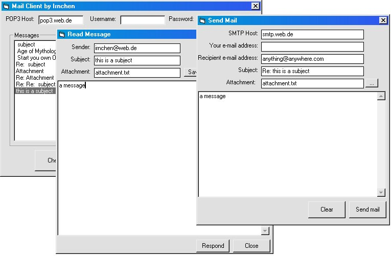

## a full mail client with support for POP3 and SMTP and attachments

### Description

Get e-mails and view them, respond them and add attachments!

Support for POP3 and SMTP.

The UUEncoding module isn't mine, but it can be found here on PSC.

Also it supports as many windows as you want.
 
### More Info
 

             |
---                |---
**Submitted On**   |2001-02-24 17:10:04
**By**             |[actorics\.de](https://github.com/Planet-Source-Code/PSCIndex/blob/master/ByAuthor/actorics-de.md)
**Level**          |Intermediate
**User Rating**    |4.8 (207 globes from 43 users)
**Compatibility**  |VB 6\.0
**Category**       |[Complete Applications](https://github.com/Planet-Source-Code/PSCIndex/blob/master/ByCategory/complete-applications__1-27.md)
**World**          |[Visual Basic](https://github.com/Planet-Source-Code/PSCIndex/blob/master/ByWorld/visual-basic.md)
**Archive File**   |[a\_full\_mai15038611262002\.zip](https://github.com/Planet-Source-Code/actorics-de-a-full-mail-client-with-support-for-pop3-and-smtp-and-attachments__1-41066/archive/master.zip)

